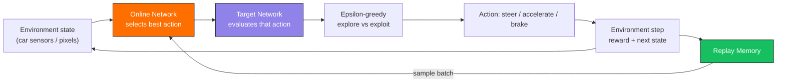

<a name="top"></a>
<div align="center">

# 🚗 Autonomous Car using DDQN

### Teaching a car to drive itself, one Q-value at a time

[](https://python.org)
[](https://tensorflow.org)
[](https://pytorch.org)
[](https://www.gymlibrary.dev)
[](https://www.pygame.org)

A **Deep Double Q-Network (DDQN)** agent that learns to navigate a simulated driving environment and avoid obstacles through reinforcement learning — no hand-coded driving rules, just reward signals.

[Features](#-features) · [How it works](#%EF%B8%8F-how-it-works) · [Install](#%EF%B8%8F-installation) · [Usage](#%EF%B8%8F-usage) · [Results](#-results) · [References](#-references)

</div>

---

## 🎯 Why DDQN

Vanilla Deep Q-Learning tends to **overestimate action values**, which can make a driving agent overconfident about risky moves — like a lane change that looks good in training but isn't. **Double Q-Learning** splits action *selection* from action *evaluation* across two networks, which keeps those estimates honest and makes training noticeably more stable.



---

## 📌 Features

| Feature | Description |
|---|---|
| 🧠 **Deep Double Q-Learning (DDQN)** | Separate action selection and evaluation to reduce Q-value overestimation |
| 🎲 **Epsilon-greedy exploration** | Balances trying new actions against exploiting what the agent already knows |
| 🔁 **Experience replay** | Stores past transitions in a replay buffer and trains on randomized batches for stability |
| 🎯 **Target network** | A slowly-updated copy of the Q-network keeps training targets stable |
| 🏎️ **Car simulation environment** | Custom environment or OpenAI Gym for the driving/obstacle-avoidance task |
| 📜 **Training & evaluation scripts** | Separate entry points for training the agent and testing a trained checkpoint |

---

## ⚙️ How it works

1. **Observe** the current state (sensor readings or rendered frame from the simulation)
2. **Select an action** — steer, accelerate, or brake — using epsilon-greedy exploration
3. **Step the environment** and collect the reward + next state (reward shaped around staying on track / avoiding obstacles)
4. **Store the transition** `(state, action, reward, next_state)` in replay memory
5. **Sample a batch** from replay memory and train the online network
6. **Double Q-update**: the online network picks the best next action, the target network evaluates it — decoupling selection from evaluation to curb overestimation
7. **Periodically sync** the target network's weights from the online network
8. Repeat across episodes until the agent reliably avoids obstacles

---

## 🛠️ Installation

Clone the repository:

```bash
git clone https://github.com/aashirchowdhari/self-driving-car-rl.git
cd self-driving-car-rl
```

Install the dependencies:

```bash
pip install -r requirements.txt
```

### 📦 Requirements

```
numpy
tensorflow
keras
torch
gym
pygame
matplotlib
```

> Adjust this list depending on which framework (TensorFlow/Keras or PyTorch) your implementation actually uses — you likely don't need both.

---

## ▶️ Usage

### Train the agent

```bash
python train.py
```

### Test the trained agent

```bash
python test.py
```

---

## 📊 Results

- 📈 **Reward vs. episodes** plots showing learning progress over training
- 🚘 **Simulation playback** of the trained car driving in the environment
- *(Optional: drop gifs/screenshots of the trained car driving here)*

---

## 📚 References

- Mnih et al., *Playing Atari with Deep Reinforcement Learning* (2015)
- van Hasselt et al., *Deep Reinforcement Learning with Double Q-learning* (2016)

---

## 👨‍💻 Author

Developed by **Aashir Chowdhari** as part of a reinforcement learning project.

<div align="center">

<a href="#top">⬆️ Back to top</a>

</div>
